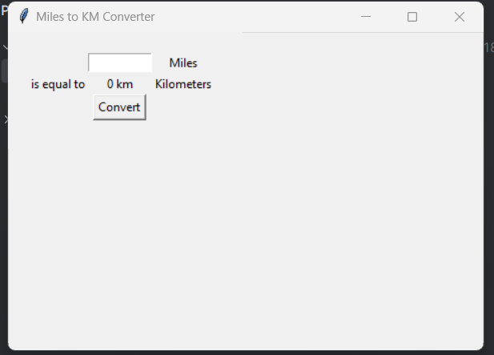
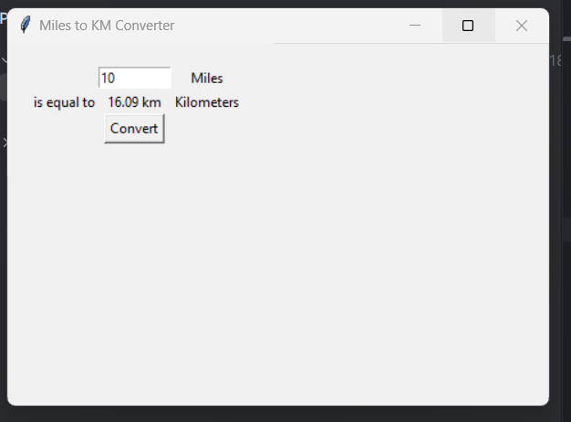

# 🛣️ Miles to Kilometers Converter

This is a simple Python GUI application built with **Tkinter** that allows users to convert distance in **miles** to **kilometers**. It is designed with a user-friendly interface for easy input and instant results.

---

## 📸 Screenshots

### 🔹 Input Interface


### 🔹 Result Example


---

## 🧠 How It Works

- The user enters a distance in **miles**.
- On clicking the **Convert** button, the app calculates and displays the equivalent distance in **kilometers**.

---

## 🧮 Formula Used

> **1 mile = 1.60934 kilometers**

---

## 🛠️ Technologies Used

- **Python 3**
- **Tkinter (built-in GUI library)**

---

## 🚀 How to Run

1. Make sure Python is installed.
2. Save the script as `converter.py`.
3. Run the program:

```bash
python main.py
